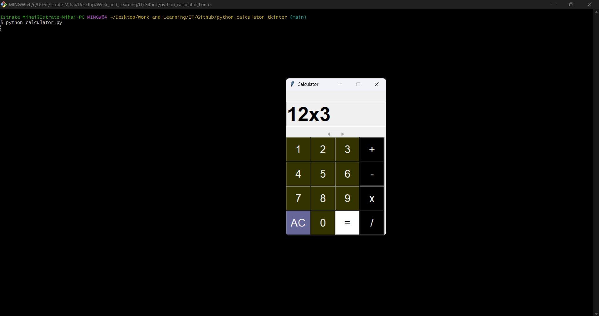

# 🧮 Tkinter Calculator

A simple desktop calculator built with Python and Tkinter.



## Requirements

- Python 3.x
- Tkinter (included in the Python standard library)

## Run

```bash
python calculator.py
```

> No dependencies to install — Tkinter ships with Python out of the box.

## Features

- Basic arithmetic: `+`, `-`, `x`, `/`
- Expression display — shows the full input before evaluating
- **AC** — clears the current expression
- Minimal UI with a dark olive button theme

## Project Structure

```
python_calculator_tkinter/
├── calculator.py   # Main application
├── screenshot.png
└── README.md
```

## Notes

- Built as part of a Python learning path
- Tkinter is stdlib-only — no `pip install` required
- Runs via Git Bash / MINGW64 on Windows or any standard Python environment
